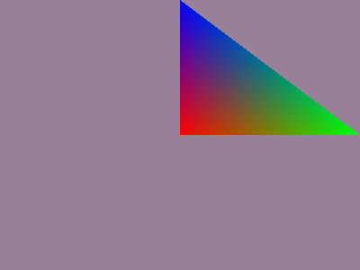
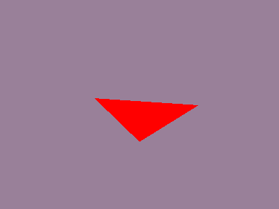
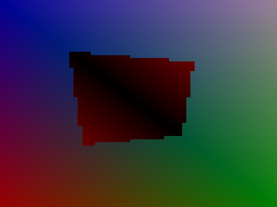
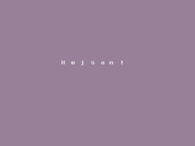
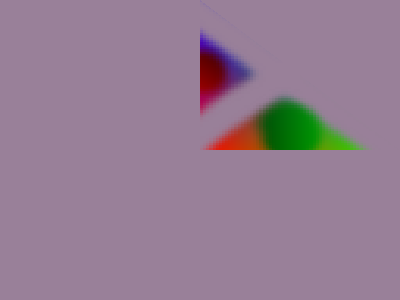
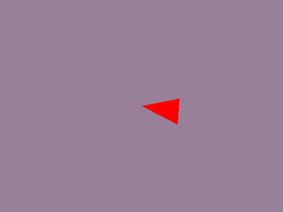
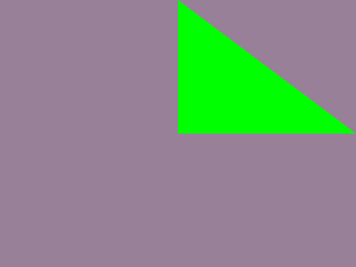

ES Toolkit
==========
Simple game development toolkit.
Use with SDL+SDL_image, compatible with Linux desktop, Windows desktop and asm.js (emscripten) environments. 
Tested and works with SDL+GLEW and in asm.js browsers with Emscripten compiler.

  Check out the demos in the repository root folder to get an understanding of all the features!

Usage
-----
Copy estk.c and estk.h into your project.
Include estk.h and use it any way you want.

Features
--------
 * FPS bound game loop
 * OpenGL ES Compatibility
 * WebGL compatibility
 * GLSL Shaders wrapper
 * OpenGL vertex buffer wrapper
 * Projection matrix generators
 * Texture file loading

Demos screenshots
-----------------

Documentation
-------------
API reference manual: [This link](API.md)

There is sample code for all aspects of the toolkit.
Se files with demo prefix.

To compile the emscripten demos you must have emscripten installed on your system.
Point EMCC to the emscripten emcc compiler.
Standard for this is /opt/emscripten/emcc.

